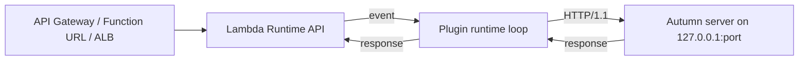

# autumn-plugin-aws-lambda

Run an [Autumn](https://autumn-web.app) (`autumn-web` 0.7) application on
AWS Lambda. Add one line. The same binary also runs as a normal server.

```rust
use autumn_plugin_aws_lambda::AwsLambdaPlugin;
use autumn_web::prelude::*;

#[get("/hello")]
async fn hello() -> &'static str {
    "hello"
}

#[autumn_web::main]
async fn main() {
    autumn_web::app()
        .plugin(AwsLambdaPlugin::new())
        .routes(routes![hello])
        .run()
        .await;
}
```

## How it works

Autumn starts its server as usual. On Lambda, the plugin starts the Lambda
runtime loop on its own thread. The loop sends each event to the Autumn
server as an HTTP request on loopback. With the default `Activation::Auto`,
the plugin stays idle outside Lambda.



See [ADR 0001](docs/adr/0001-loopback-proxy.md) for the reasons.

## Install

```toml
[dependencies]
autumn-plugin-aws-lambda = "0.1"
```

## Options

| Method | Default | Effect |
|---|---|---|
| `activation(Activation)` | `Auto` | `Auto`: start only when Lambda sets `AWS_LAMBDA_RUNTIME_API`. `Always`: start. Startup fails if a Lambda variable is missing. `Never`: stay idle. |
| `response_mode(ResponseMode)` | `Buffered` | `Buffered`: read the full body (up to 6 MiB), then send it. `Streaming`: stream the body. Use it only with a Function URL or API Gateway response streaming. |
| `upstream(SocketAddr)` | from `[server]` | The address of the Autumn server. The plugin changes `0.0.0.0` and `::` to loopback. With this option, the plugin does not check `[server]`. |
| `readiness_timeout(Duration)` | no limit | The maximum wait for Autumn startup before the first event. When the time ends, the loop starts. |
| `timeout_margin(Duration)` | 100 ms | The time between the end of the upstream call and the invocation deadline. |

## Autumn configuration for Lambda

Set these environment variables on the function:

| Variable | Value | Why |
|---|---|---|
| `AUTUMN_SECURITY__TRUSTED_HOSTS__HOSTS` | your exact hostname, for example `abc123.lambda-url.us-east-1.on.aws` | Autumn checks the `Host` header. The plugin keeps the original `Host`. Autumn returns `400` for other hosts. |
| `AUTUMN_SECURITY__TRUSTED_PROXIES__RANGES` | `127.0.0.1/32` | All requests come from loopback. See "Client IP" below. |
| `AUTUMN_SECURITY__TRUSTED_PROXIES__TRUST_FORWARDED_HEADERS` | `true` | Same reason. |
| `AUTUMN_SERVER__PRESTOP_GRACE_SECS` | `0` | Lambda gives little time at shutdown. The plugin logs a warning if the value is higher. |
| `AUTUMN_SERVER__SHUTDOWN_TIMEOUT_SECS` | `1` | Same reason. |

Do not set `server.unix_socket`, `server.tls`, or `server.port = 0`. If you
set one, the plugin stops at startup with an error.

### Event source settings

- **API Gateway REST API:** set binary media types to `*/*`. Autumn can
  send compressed or binary bodies. Lambda sends these as base64.
- **ALB:** turn on multi-value headers
  (`lambda.multi_value_headers.enabled`). If you do not, the client gets
  only the first `Set-Cookie` header.
- **VPC Lattice:** the client gets only the first `Set-Cookie` header.

## Behavior

- **Path.** The plugin sends the path that AWS routed, with no change. It
  does not remove `..` segments. The REST API stage is not in the path.
- **Timeouts.** In `Buffered` mode, the upstream call and the body get
  `deadline - now - margin`. In `Streaming` mode, only the response head
  gets it. After that time, the response is `504 Gateway Timeout`.
- **Upstream failure.** The response is `502 Bad Gateway`. The plugin does
  not send a Lambda invocation error, so callers do not retry. In
  `Streaming` mode, a body error after the head ends the stream.
- **Request headers.** The plugin removes hop-by-hop headers. It removes
  `x-forwarded-host`, `x-real-ip`, and `forwarded`, because a client can
  set them. It sets `lambda-runtime-aws-request-id` to the Lambda request
  ID.
- **Response headers.** The plugin removes hop-by-hop headers. It joins
  repeated headers into one value, but not `Set-Cookie`. Some event
  sources keep only the first value.
- **Text bodies.** In `Buffered` mode, `lambda_http` sends text bodies as
  UTF-8. If this changes the bytes, the plugin adds
  `content-encoding: identity`. Lambda then sends the body as base64.
- **Client IP.** The plugin sets `x-forwarded-for` to one value: the
  client IP that AWS saw. With the trusted proxy settings above,
  `ClientAddr` gives the real client IP. If you do not trust loopback,
  `ClientAddr` is `127.0.0.1` for all clients. Then all clients share one
  rate limit, and an allow list with `127.0.0.1` accepts all clients.
- **Startup.** The loop waits until Autumn startup is complete. If Autumn
  shuts down first, the loop does not start. In Autumn task mode
  (`AUTUMN_RUN_TASK`), the plugin stays idle.
- **Concurrency.** When `AWS_LAMBDA_MAX_CONCURRENCY` is more than 1
  (Lambda Managed Instances), the loop handles events at the same time on
  more threads.
- **Loop failure.** If the runtime loop stops, the process exits with code
  1. Lambda then starts a new execution environment. This exit does not
  run Autumn shutdown hooks. In concurrent mode, `lambda_runtime` does not
  stop on errors. So the plugin checks the Runtime API every second. After
  5 failures in sequence, the process exits with code 1.

## Build and deploy

Use [cargo-lambda](https://www.cargo-lambda.info/):

```sh
cargo lambda build --release --arm64
cargo lambda deploy \
  --env-var AUTUMN_SECURITY__TRUSTED_HOSTS__HOSTS=abc123.lambda-url.us-east-1.on.aws
```

## Example

`examples/hello.rs` is a full app. To run it on your computer:

```sh
cargo run --example hello
curl http://127.0.0.1:3000/hello
```

## Development

| Task | Command |
|---|---|
| Format | `cargo fmt` |
| Lint | `cargo clippy --all-targets -- -D warnings` |
| Docs | `RUSTDOCFLAGS="-D warnings" cargo doc --no-deps` |
| Test | `cargo test` |
| Coverage | `cargo llvm-cov --summary-only` |
| Proofs | `VERUS=/path/to/verus verification/verify.sh` |

To use the pre-commit hook, type `git config core.hooksPath .githooks`.

`verification/core.rs` has Verus proofs for the pure core.
`tests/spec_conformance.rs` checks that the runtime code agrees with the
model. The planning notes are in [docs/planning.md](docs/planning.md).

## License

Apache-2.0. See [LICENSE](LICENSE).
