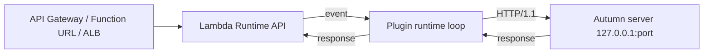

# autumn-plugin-aws-lambda

Run an [Autumn](https://autumn-web.app) (`autumn-web` 0.7) application on
AWS Lambda. Add one line. The same binary also runs as a normal server.

```rust
use autumn_plugin_aws_lambda::AwsLambdaPlugin;
use autumn_web::prelude::*;

#[get("/hello")]
async fn hello() -> &'static str {
    "hello"
}

#[autumn_web::main]
async fn main() {
    autumn_web::app()
        .plugin(AwsLambdaPlugin::new())
        .routes(routes![hello])
        .run()
        .await;
}
```

## How it works

Autumn serves on a loopback port. On Lambda, the plugin starts the Lambda
runtime loop. The loop sends each event to Autumn as an HTTP request.
Outside Lambda, the plugin does nothing.



See [ADR 0001](docs/adr/0001-loopback-proxy.md) for the reasons.

## Install

```toml
[dependencies]
autumn-plugin-aws-lambda = "0.1"
```

## Options

| Method | Default | Effect |
|---|---|---|
| `activation(Activation)` | `Auto` | `Auto`: start only when `AWS_LAMBDA_RUNTIME_API` is set. `Always`: start, or fail at startup. `Never`: do nothing. |
| `response_mode(ResponseMode)` | `Buffered` | `Buffered`: read the full body, then return it. `Streaming`: stream the body (Function URL or API Gateway streaming). |
| `upstream(SocketAddr)` | from `[server]` | Address of the Autumn server. `0.0.0.0` and `::` change to loopback. |
| `readiness_timeout(Duration)` | 10 s | Maximum wait for Autumn startup before the first event. |
| `timeout_margin(Duration)` | 100 ms | Time to keep free before the invocation deadline. |

## Autumn configuration for Lambda

Set these with environment variables on the function:

| Variable | Value | Why |
|---|---|---|
| `AUTUMN_SECURITY__TRUSTED_HOSTS__HOSTS` | your domain, for example `.lambda-url.us-east-1.on.aws` | Autumn checks the `Host` header. The plugin keeps the original `Host`. Other hosts get `400`. |
| `AUTUMN_SERVER__PRESTOP_GRACE_SECS` | `0` | Lambda gives little time at shutdown. |
| `AUTUMN_SERVER__SHUTDOWN_TIMEOUT_SECS` | `1` | Same reason. |
| `AWS_LAMBDA_HTTP_IGNORE_STAGE_IN_PATH` | `true` | Optional. Removes the API Gateway REST stage from the path. |

Do not set `server.unix_socket`, `server.tls`, or `server.port = 0`.
The plugin stops at startup with a clear error if you do.

## Behavior

- **Timeouts.** The upstream call gets `deadline - now - margin`.
  After that, the response is `504 Gateway Timeout`.
- **Upstream failure.** The response is `502 Bad Gateway`. The plugin does
  not return a Lambda invocation error, so callers do not retry.
- **Headers.** The plugin removes hop-by-hop headers in both directions.
  It sets `x-request-id` to the Lambda request ID if the header is not
  present. It keeps `Host` and `X-Forwarded-*` from AWS.
- **Client IP.** To use `X-Forwarded-For`, trust loopback in
  `[security.trusted_proxies]`.
- **Concurrency.** When `AWS_LAMBDA_MAX_CONCURRENCY` is above 1 (Lambda
  Managed Instances), the loop handles events at the same time.
- **Loop failure.** If the runtime loop stops, the process exits with
  code 1. Lambda then starts a new execution environment.

## Build and deploy

Use [cargo-lambda](https://www.cargo-lambda.info/):

```sh
cargo lambda build --release --arm64
cargo lambda deploy --env-var AUTUMN_SECURITY__TRUSTED_HOSTS__HOSTS=.on.aws
```

## Example

`examples/hello.rs` is a full app. Run it on your machine:

```sh
cargo run --example hello
curl http://127.0.0.1:3000/hello
```

## Development

| Task | Command |
|---|---|
| Format | `cargo fmt` |
| Lint | `cargo clippy --all-targets -- -D warnings` |
| Test | `cargo test` |
| Coverage | `cargo llvm-cov --summary-only` |
| Proofs | `VERUS=/path/to/verus verification/verify.sh` |

Enable the pre-commit hook: `git config core.hooksPath .githooks`.

The pure core has Verus proofs in `verification/core.rs`.
`tests/spec_conformance.rs` checks that the runtime code agrees with the
model. The planning notes are in [docs/planning.md](docs/planning.md).

## License

Apache-2.0. See [LICENSE](LICENSE).
